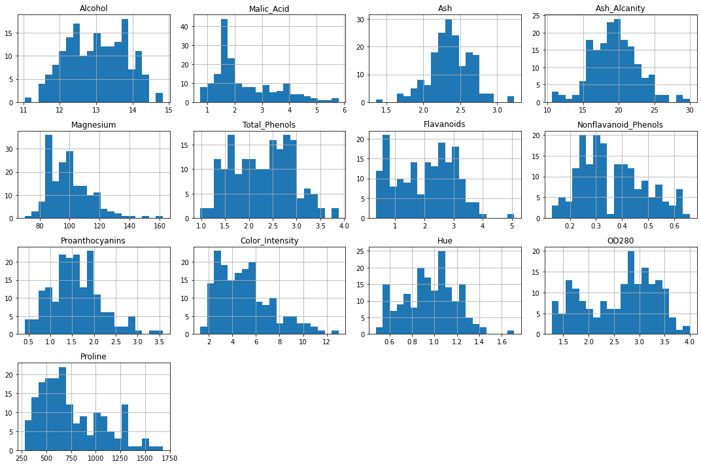
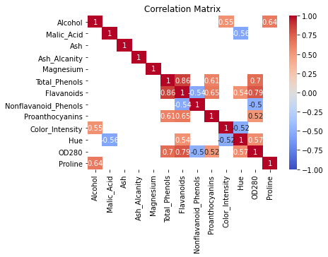
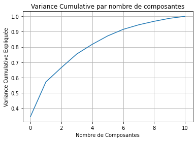
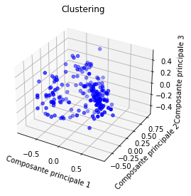
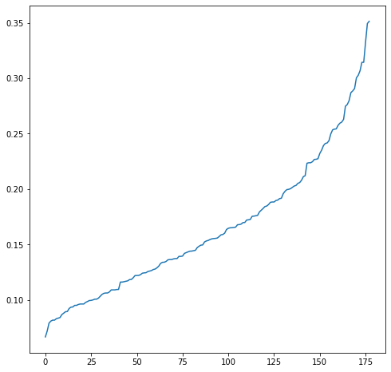
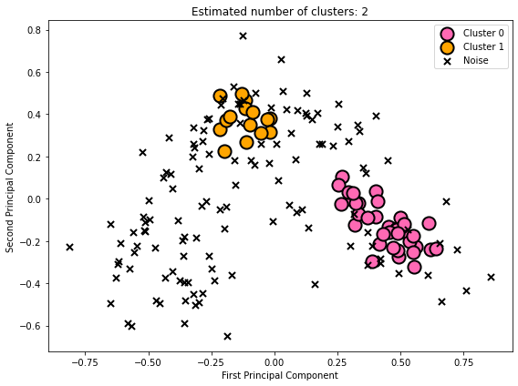
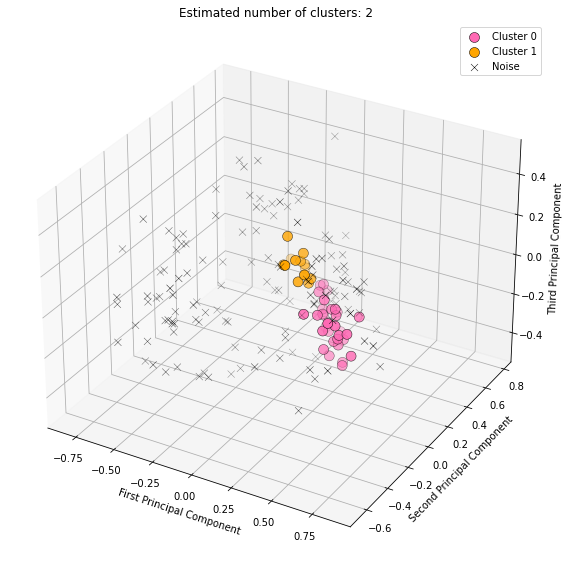
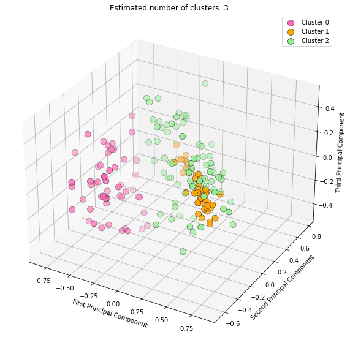

```python
import numpy as np 
import pandas as pd 
import seaborn as sns
import matplotlib.pyplot as plt 
import warnings 
from sklearn.cluster import DBSCAN, KMeans
from sklearn.preprocessing import StandardScaler,MinMaxScaler
from sklearn.decomposition import PCA
from sklearn.neighbors import NearestNeighbors


warnings.filterwarnings("ignore")


```


```python
df = pd.read_csv("wine-clustering.csv")
df.info()
```

    <class 'pandas.core.frame.DataFrame'>
    RangeIndex: 178 entries, 0 to 177
    Data columns (total 13 columns):
     #   Column                Non-Null Count  Dtype  
    ---  ------                --------------  -----  
     0   Alcohol               178 non-null    float64
     1   Malic_Acid            178 non-null    float64
     2   Ash                   178 non-null    float64
     3   Ash_Alcanity          178 non-null    float64
     4   Magnesium             178 non-null    int64  
     5   Total_Phenols         178 non-null    float64
     6   Flavanoids            178 non-null    float64
     7   Nonflavanoid_Phenols  178 non-null    float64
     8   Proanthocyanins       178 non-null    float64
     9   Color_Intensity       178 non-null    float64
     10  Hue                   178 non-null    float64
     11  OD280                 178 non-null    float64
     12  Proline               178 non-null    int64  
    dtypes: float64(11), int64(2)
    memory usage: 18.2 KB
    


```python
df.columns
```


    Index(['Alcohol', 'Malic_Acid', 'Ash', 'Ash_Alcanity', 'Magnesium',
           'Total_Phenols', 'Flavanoids', 'Nonflavanoid_Phenols',
           'Proanthocyanins', 'Color_Intensity', 'Hue', 'OD280', 'Proline'],
          dtype='object')


```python
df.head()
```


<div>
<style scoped>
    .dataframe tbody tr th:only-of-type {
        vertical-align: middle;
    }

    .dataframe tbody tr th {
        vertical-align: top;
    }

    .dataframe thead th {
        text-align: right;
    }
</style>
<table border="1" class="dataframe">
  <thead>
    <tr style="text-align: right;">
      <th></th>
      <th>Alcohol</th>
      <th>Malic_Acid</th>
      <th>Ash</th>
      <th>Ash_Alcanity</th>
      <th>Magnesium</th>
      <th>Total_Phenols</th>
      <th>Flavanoids</th>
      <th>Nonflavanoid_Phenols</th>
      <th>Proanthocyanins</th>
      <th>Color_Intensity</th>
      <th>Hue</th>
      <th>OD280</th>
      <th>Proline</th>
    </tr>
  </thead>
  <tbody>
    <tr>
      <th>0</th>
      <td>14.23</td>
      <td>1.71</td>
      <td>2.43</td>
      <td>15.6</td>
      <td>127</td>
      <td>2.80</td>
      <td>3.06</td>
      <td>0.28</td>
      <td>2.29</td>
      <td>5.64</td>
      <td>1.04</td>
      <td>3.92</td>
      <td>1065</td>
    </tr>
    <tr>
      <th>1</th>
      <td>13.20</td>
      <td>1.78</td>
      <td>2.14</td>
      <td>11.2</td>
      <td>100</td>
      <td>2.65</td>
      <td>2.76</td>
      <td>0.26</td>
      <td>1.28</td>
      <td>4.38</td>
      <td>1.05</td>
      <td>3.40</td>
      <td>1050</td>
    </tr>
    <tr>
      <th>2</th>
      <td>13.16</td>
      <td>2.36</td>
      <td>2.67</td>
      <td>18.6</td>
      <td>101</td>
      <td>2.80</td>
      <td>3.24</td>
      <td>0.30</td>
      <td>2.81</td>
      <td>5.68</td>
      <td>1.03</td>
      <td>3.17</td>
      <td>1185</td>
    </tr>
    <tr>
      <th>3</th>
      <td>14.37</td>
      <td>1.95</td>
      <td>2.50</td>
      <td>16.8</td>
      <td>113</td>
      <td>3.85</td>
      <td>3.49</td>
      <td>0.24</td>
      <td>2.18</td>
      <td>7.80</td>
      <td>0.86</td>
      <td>3.45</td>
      <td>1480</td>
    </tr>
    <tr>
      <th>4</th>
      <td>13.24</td>
      <td>2.59</td>
      <td>2.87</td>
      <td>21.0</td>
      <td>118</td>
      <td>2.80</td>
      <td>2.69</td>
      <td>0.39</td>
      <td>1.82</td>
      <td>4.32</td>
      <td>1.04</td>
      <td>2.93</td>
      <td>735</td>
    </tr>
  </tbody>
</table>
</div>


```python
df.describe()
```


<div>
<style scoped>
    .dataframe tbody tr th:only-of-type {
        vertical-align: middle;
    }

    .dataframe tbody tr th {
        vertical-align: top;
    }

    .dataframe thead th {
        text-align: right;
    }
</style>
<table border="1" class="dataframe">
  <thead>
    <tr style="text-align: right;">
      <th></th>
      <th>Alcohol</th>
      <th>Malic_Acid</th>
      <th>Ash</th>
      <th>Ash_Alcanity</th>
      <th>Magnesium</th>
      <th>Total_Phenols</th>
      <th>Flavanoids</th>
      <th>Nonflavanoid_Phenols</th>
      <th>Proanthocyanins</th>
      <th>Color_Intensity</th>
      <th>Hue</th>
      <th>OD280</th>
      <th>Proline</th>
    </tr>
  </thead>
  <tbody>
    <tr>
      <th>count</th>
      <td>178.000000</td>
      <td>178.000000</td>
      <td>178.000000</td>
      <td>178.000000</td>
      <td>178.000000</td>
      <td>178.000000</td>
      <td>178.000000</td>
      <td>178.000000</td>
      <td>178.000000</td>
      <td>178.000000</td>
      <td>178.000000</td>
      <td>178.000000</td>
      <td>178.000000</td>
    </tr>
    <tr>
      <th>mean</th>
      <td>13.000618</td>
      <td>2.336348</td>
      <td>2.366517</td>
      <td>19.494944</td>
      <td>99.741573</td>
      <td>2.295112</td>
      <td>2.029270</td>
      <td>0.361854</td>
      <td>1.590899</td>
      <td>5.058090</td>
      <td>0.957449</td>
      <td>2.611685</td>
      <td>746.893258</td>
    </tr>
    <tr>
      <th>std</th>
      <td>0.811827</td>
      <td>1.117146</td>
      <td>0.274344</td>
      <td>3.339564</td>
      <td>14.282484</td>
      <td>0.625851</td>
      <td>0.998859</td>
      <td>0.124453</td>
      <td>0.572359</td>
      <td>2.318286</td>
      <td>0.228572</td>
      <td>0.709990</td>
      <td>314.907474</td>
    </tr>
    <tr>
      <th>min</th>
      <td>11.030000</td>
      <td>0.740000</td>
      <td>1.360000</td>
      <td>10.600000</td>
      <td>70.000000</td>
      <td>0.980000</td>
      <td>0.340000</td>
      <td>0.130000</td>
      <td>0.410000</td>
      <td>1.280000</td>
      <td>0.480000</td>
      <td>1.270000</td>
      <td>278.000000</td>
    </tr>
    <tr>
      <th>25%</th>
      <td>12.362500</td>
      <td>1.602500</td>
      <td>2.210000</td>
      <td>17.200000</td>
      <td>88.000000</td>
      <td>1.742500</td>
      <td>1.205000</td>
      <td>0.270000</td>
      <td>1.250000</td>
      <td>3.220000</td>
      <td>0.782500</td>
      <td>1.937500</td>
      <td>500.500000</td>
    </tr>
    <tr>
      <th>50%</th>
      <td>13.050000</td>
      <td>1.865000</td>
      <td>2.360000</td>
      <td>19.500000</td>
      <td>98.000000</td>
      <td>2.355000</td>
      <td>2.135000</td>
      <td>0.340000</td>
      <td>1.555000</td>
      <td>4.690000</td>
      <td>0.965000</td>
      <td>2.780000</td>
      <td>673.500000</td>
    </tr>
    <tr>
      <th>75%</th>
      <td>13.677500</td>
      <td>3.082500</td>
      <td>2.557500</td>
      <td>21.500000</td>
      <td>107.000000</td>
      <td>2.800000</td>
      <td>2.875000</td>
      <td>0.437500</td>
      <td>1.950000</td>
      <td>6.200000</td>
      <td>1.120000</td>
      <td>3.170000</td>
      <td>985.000000</td>
    </tr>
    <tr>
      <th>max</th>
      <td>14.830000</td>
      <td>5.800000</td>
      <td>3.230000</td>
      <td>30.000000</td>
      <td>162.000000</td>
      <td>3.880000</td>
      <td>5.080000</td>
      <td>0.660000</td>
      <td>3.580000</td>
      <td>13.000000</td>
      <td>1.710000</td>
      <td>4.000000</td>
      <td>1680.000000</td>
    </tr>
  </tbody>
</table>
</div>


```python
df.isnull().sum()
```


    Alcohol                 0
    Malic_Acid              0
    Ash                     0
    Ash_Alcanity            0
    Magnesium               0
    Total_Phenols           0
    Flavanoids              0
    Nonflavanoid_Phenols    0
    Proanthocyanins         0
    Color_Intensity         0
    Hue                     0
    OD280                   0
    Proline                 0
    dtype: int64


Il n'y a pas de valeurs manquantes dans le dataset


```python
plt.figure(figsize=(15, 10))
df.hist(bins=20, figsize=(15, 10))
plt.tight_layout()
plt.show()
```


    <Figure size 1080x720 with 0 Axes>


    

    


```python
correlation_matrix = df.corr()
filtered_corr = correlation_matrix.where(np.abs(correlation_matrix) > 0.50)

sns.heatmap(filtered_corr, annot=True, cmap='coolwarm', vmin=-1, vmax=1)
plt.title('Correlation Matrix')
plt.show()
```


    

    


```python
df = df.drop(['Total_Phenols','OD280'] ,axis=1)
```

On enleve ces collones car tres corrélées avec la collone "Flavanoids", On va maintenant normalisé les donnée pour faire une PCA


```python

```


```python
normal = MinMaxScaler()
data=normal.fit_transform(df)

```

On va chercher le nombre de dimensions


```python
pca = PCA()
pca.fit(data)

# Visualiser la variance expliquée cumulée par chaque composante
plt.plot(np.cumsum(pca.explained_variance_ratio_))
plt.xlabel('Nombre de Composantes')
plt.ylabel('Variance Cumulative Expliquée')
plt.title('Variance Cumulative par nombre de composantes')
plt.grid(True)
plt.show()
```


    

    


```python
pca=PCA(n_components=3)
data_pca=pca.fit_transform(data)
```


```python
df_pca = pd.DataFrame(data=data_pca, columns = ['C1','C2','C3'])
df_pca.describe()

```


<div>
<style scoped>
    .dataframe tbody tr th:only-of-type {
        vertical-align: middle;
    }

    .dataframe tbody tr th {
        vertical-align: top;
    }

    .dataframe thead th {
        text-align: right;
    }
</style>
<table border="1" class="dataframe">
  <thead>
    <tr style="text-align: right;">
      <th></th>
      <th>C1</th>
      <th>C2</th>
      <th>C3</th>
    </tr>
  </thead>
  <tbody>
    <tr>
      <th>count</th>
      <td>1.780000e+02</td>
      <td>1.780000e+02</td>
      <td>1.780000e+02</td>
    </tr>
    <tr>
      <th>mean</th>
      <td>1.066563e-16</td>
      <td>6.860929e-18</td>
      <td>-6.081278e-18</td>
    </tr>
    <tr>
      <th>std</th>
      <td>3.831100e-01</td>
      <td>3.106942e-01</td>
      <td>1.999045e-01</td>
    </tr>
    <tr>
      <th>min</th>
      <td>-8.140894e-01</td>
      <td>-6.504319e-01</td>
      <td>-4.814182e-01</td>
    </tr>
    <tr>
      <th>25%</th>
      <td>-3.141264e-01</td>
      <td>-2.314322e-01</td>
      <td>-1.391073e-01</td>
    </tr>
    <tr>
      <th>50%</th>
      <td>-5.491033e-02</td>
      <td>-4.915850e-02</td>
      <td>-9.533224e-03</td>
    </tr>
    <tr>
      <th>75%</th>
      <td>3.362852e-01</td>
      <td>2.703851e-01</td>
      <td>1.453937e-01</td>
    </tr>
    <tr>
      <th>max</th>
      <td>8.589141e-01</td>
      <td>7.730470e-01</td>
      <td>4.965430e-01</td>
    </tr>
  </tbody>
</table>
</div>


```python
from mpl_toolkits.mplot3d import Axes3D

fig = plt.figure()
ax = fig.add_subplot(111, projection='3d')


ax.scatter(df_pca['C1'], df_pca['C2'], df_pca['C3'], c='blue')  # Ajoutez c=clusters si vous avez des clusters


ax.set_xlabel('Composante principale 1')
ax.set_ylabel('Composante principale 2')
ax.set_zlabel('Composante principale 3')

ax.set_title('Clustering')

plt.show()
```


    

    


```python
neighbours=NearestNeighbors( n_neighbors=5, radius=None, algorithm='kd_tree',metric='minkowski', p=2, metric_params=None, n_jobs=None)
nbrs=neighbours.fit(df_pca)
dis,ind=nbrs.kneighbors(df_pca)

dis=np.sort(dis,axis=0)
dis=dis[:,-1]

plt.figure(figsize=(8,8))
plt.plot(dis)
```


    [<matplotlib.lines.Line2D at 0x28bc98c54c0>]


    

    


```python

```


```python
def perform_dbscan(data, eps, min_samples):
    dbscan = DBSCAN(eps=eps, min_samples=min_samples)
    labels = dbscan.fit_predict(data)
    n_clusters = len(set(labels)) - (1 if -1 in labels else 0)
    n_noise = list(labels).count(-1)
    return labels, n_clusters, n_noise
```


```python
def visualize_clusters(data, labels):
    plt.figure(figsize=(8, 6))
    
    palette = ['#FF69B4', '#FFA500', '#90EE90']
    
    unique_labels = set(labels)
    for i, label in enumerate(unique_labels):
        if label == -1:
            # Black color for noise points
            color = 'black'
            marker = 'x'
            size = 50
            label_text = 'Noise'
        else:
            color = palette[i % len(palette)]
            marker = 'o'
            size = 200
            label_text = f'Cluster {label}'
        
        mask = labels == label
        plt.scatter(data[mask, 0], data[mask, 1], c=[color], 
                    marker=marker, s=size, label=label_text, 
                    edgecolor='black', linewidth=2.0)
    
    plt.title(f"Estimated number of clusters: {len(unique_labels) - 1}")
    plt.legend()
    plt.xlabel('First Principal Component')
    plt.ylabel('Second Principal Component')
    plt.tight_layout()
    plt.show()
```


```python
eps = 0.15
min_samples = 11

labels, n_clusters, n_noise = perform_dbscan(df_pca.values, eps, min_samples)

df_pca['cluster'] = labels

print(f'Number of Clusters: {n_clusters}')
print(f'Number of Outliers: {n_noise}')

visualize_clusters(df_pca.values, labels)
```

    Number of Clusters: 2
    Number of Outliers: 127
    


    

    


```python
from mpl_toolkits.mplot3d import Axes3D
import matplotlib.pyplot as plt

def visualize_clusters_3d(data, labels):
    fig = plt.figure(figsize=(10, 8))
    ax = fig.add_subplot(111, projection='3d')
    
    palette = ['#FF69B4', '#FFA500', '#90EE90', '#6495ED', '#FFD700', '#ADFF2F']
    
    unique_labels = set(labels)
    for i, label in enumerate(unique_labels):
        if label == -1:
            color = 'black'
            marker = 'x'
            size = 50
            label_text = 'Noise'
        else:
            color = palette[i % len(palette)]
            marker = 'o'
            size = 100
            label_text = f'Cluster {label}'
        
        mask = labels == label
        ax.scatter(data[mask, 0], data[mask, 1], data[mask, 2], 
                   c=[color], marker=marker, s=size, label=label_text, 
                   edgecolor='black', linewidth=0.5)
    
    ax.set_title(f"Estimated number of clusters: {len(unique_labels) - (1 if -1 in unique_labels else 0)}")
    ax.set_xlabel('First Principal Component')
    ax.set_ylabel('Second Principal Component')
    ax.set_zlabel('Third Principal Component')
    
    plt.legend()
    plt.tight_layout()
    plt.show()

```


```python
eps = 0.14
min_samples = 10

labels, n_clusters, n_noise = perform_dbscan(df_pca.values, eps, min_samples)

df_pca['cluster'] = labels

print(f'Number of Clusters: {n_clusters}')
print(f'Number of Outliers: {n_noise}')

visualize_clusters_3d(df_pca.values, labels)
```

    Number of Clusters: 2
    Number of Outliers: 133
    


    

    


```python
kmeans = KMeans(n_clusters=3)
kmeans.fit(df_pca)

# Obtenir les labels des clusters
labels = kmeans.labels_

visualize_clusters_3d(df_pca.values, labels)
```


    

    

